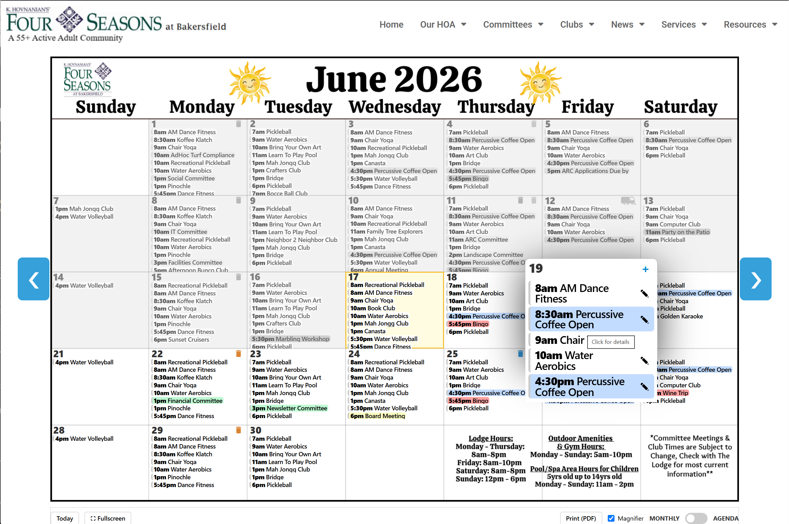
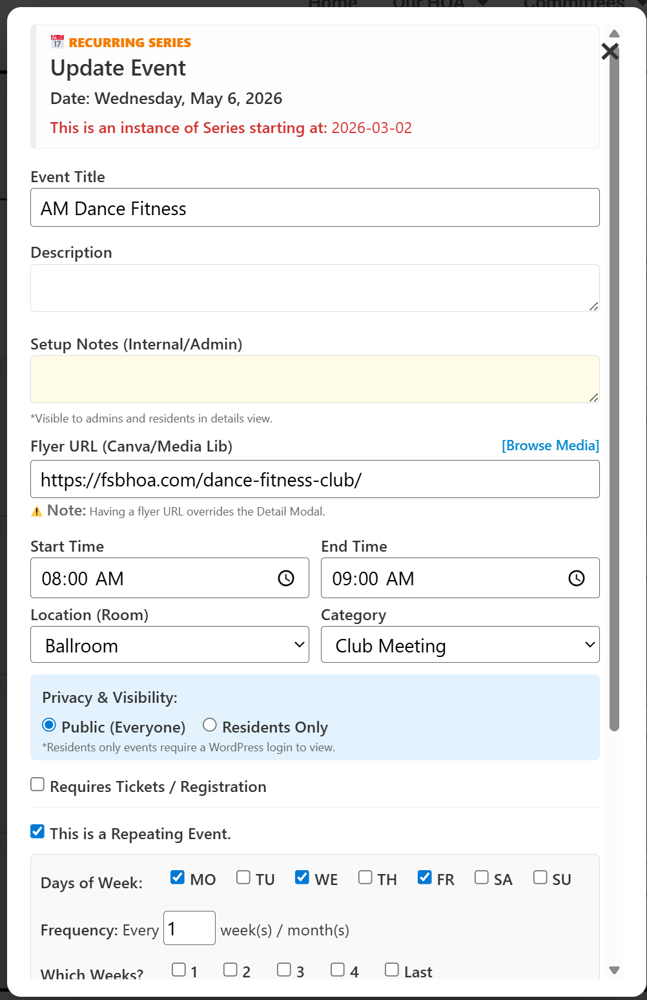
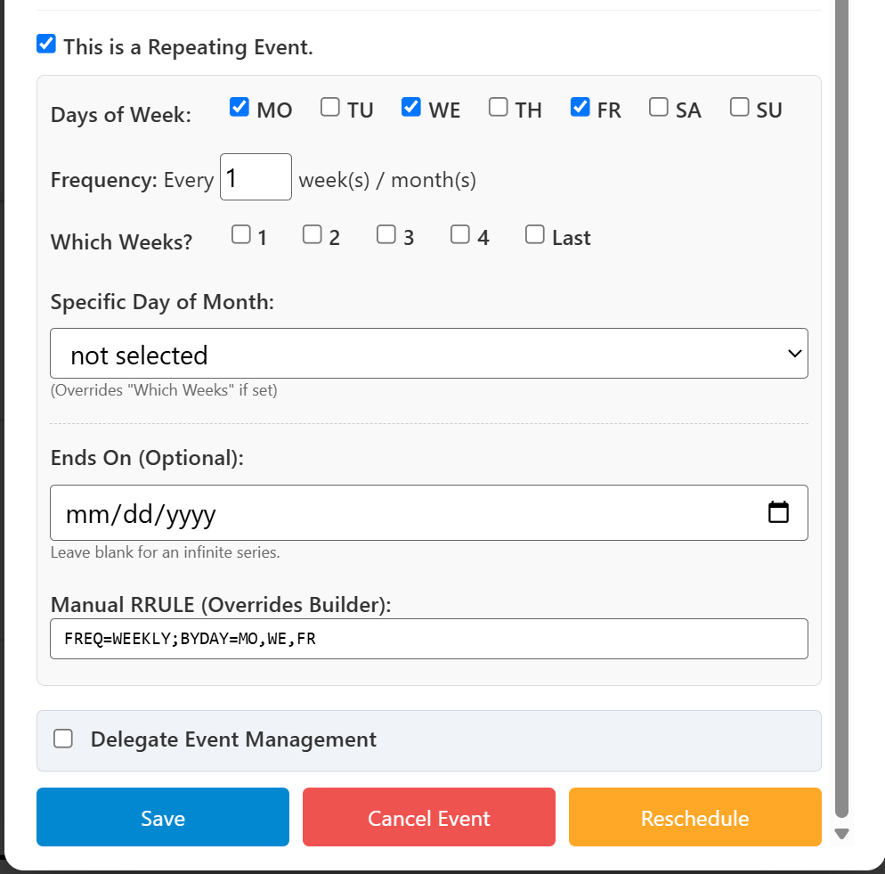

<h1 align="center">HOAplugin Calendar User Manual</h1>

<small>June 21, 2026</small>

# Chapter 1: Getting Started

Welcome to the complete website calendar tailored specifically for HOA communities. This guide will walk you through the initial setup, ensuring your calendar is perfectly configured for your residents.

> **⚠️ Before You Begin: Administrator Access Required**
> To install this calendar, you must be logged into your community website with an account that has **Administrator** permissions. You can typically access your website's login screen by adding `/wp-admin` to the end of your website address (for example: `www.myneighborhood.com/wp-admin`). 
> Note that user can view the calendar without being logged in although specific events can be marked as "Resident only" and will not be visible unless the user is logged in to the website as a subscriber.

---

## 1.1 Installing the Free Base Version

The HOAplugin Calendar comes in two versions. The free base version provides the essential calendar framework.  The Pro version is the same as the free base version but adds Pro features and includes updates and support.

1. Log into your website's WordPress Dashboard as an Administrator. Access the Dashboard via the dropdown in upper left of screen.
2. On the left-hand menu, hover over **Plugins** and click **Add New Plugin**.
3. In the search bar on the top right, type **HOAplugin Calendar**.
4. When the plugin appears in the search results, click the gray **Install Now** button.
5. Wait a few seconds for the installation to finish, then click the blue **Activate** button.

You will now see a new **HOAplugin Calendar** menu item in your left-hand Dashboard menu. This is used to configure the calendar app.

---

## 1.2 Installing the Pro Upgrade Version

To unlock premium features like visual drag-and-drop rescheduling, 11x17 PDF printing, and over-the-air dashboard updates, you must [HOAplugin.com](purchase a Pro License key). You will need to upload a second file to your website to unlock these features.

1. **Get your files:** When you purchase the Pro version at [HOAplugin.com](https://hoaplugin.com), you will receive an email containing a link to download the `hoaplugin-calendar-pro.zip` file to your computer, along with your unique **Pro License Key**. *(You can also download this file and copy your key at any time by logging into the [HOAplugin.com/manage-license](Manage License portal)).* This will download the file to your downloads folder on your PC.
2. **Upload the Plugin:** In the left menu of your WordPress dashboard, go to **Plugins > Add New Plugin**. At the very top of the screen, next to the title, click the **Upload Plugin** button.
3. **Install:** Click **Choose File**, select the `hoaplugin-calendar-pro.zip` file from your computer (in your downloads folder), and click **Install Now**.
4. **Activate plugin:** Once installed, click the blue **Activate Plugin** button.
5. **Enter your License Key:** In your left-hand WordPress dashboard menu, click the **HOAplugin Calendar** menu item. Then, click the **Pro License** tab located at the top of the settings page.
6. Paste your License Key into the box and click **Activate License**. Your premium features are now unlocked!
7. If you previously installed the Free version of HOAplugin Calendar, it may be safely deleted.

> **Administrators on a WordPress Multisite:** If you manage a complex network of multiple community sub-sites, you can purchase multiple Pro license slots and utilize a single Pro license code across all of your sites. Through the central license portal, you can easily map, add, or revoke the specific websites assigned to each of your purchased license slots using the [HOAplugin.com/manage-license](Manage license) page.

---

## 1.3 Displaying the Calendar on Your Website

Once the plugin is activated, you need to put it on a webpage so your residents can actually see it.

1. In your WordPress dashboard's left menu, go to **Pages > Add New** (or choose to edit an existing page).
2. Give your page a title, such as "Calendar".
3. Click into the main text area and type the following "shortcode" exactly as shown, including the brackets:

   `[hoaplugin_calendar]`

   Don't add anything else on that page.
4. Click the blue **Publish** or **Update** button in the top right corner.
5. You may want to add this new page to your website menu. To do that, click "Appearance" > "Menus", select your new page, click "Add to Menu", Move your menu into place, then click "Save Menu".

That's it! When you view that page, you will see your new interactive calendar grid ready to go.

### Advanced Layout Options
By default, the standard shortcode displays a full monthly grid on desktop computers that automatically transforms into a scrolling agenda list on mobile phones. If you want to force a specific layout regardless of the screen size, use these variations:

* **Monthly Grid Only:** `[hoaplugin_calendar layout="month"]`
* **Agenda List Only:** `[hoaplugin_calendar layout="agenda"]`

---

# Chapter 2: Quick-Start Tutorial (Hands-On)

When you first install the calendar, the system automatically prepopulates a fake **Sample Repeating Event** (scheduled for every Monday, Wednesday, and Friday at 9:00 AM) and a few default categories. 

Before you start adding your real community schedule, let's use this sample event as a training dummy to practice the core features! This assumes you are logged into WordPress as the administrator.

## Lesson 1: Add a One-Time Event
Let's practice adding a standalone event to the calendar.
1. Go to the public calendar page on your website.
2. Find the upcoming Saturday on the grid and click the blue **[+]** icon in the corner of that square.
3. **Event Title:** Type `Test Community Mixer`.
4. **Time:** Set it from 5:00 PM to 7:00 PM.
5. **Location:** Select `Clubhouse`.
6. **Category:** Select `Social Event`.
7. Click the blue **Save** button. You should now see your new event perfectly formatted on Saturday!

## Lesson 2: Cancel a Single Session
Imagine the instructor for your Monday/Wednesday/Friday class is sick this coming Wednesday. We need to cancel *just* that day without deleting the whole series.
1. Find this coming Wednesday's **Sample Repeating Event** on the calendar.
2. Hover over the event, then click the **✎ (Pencil)** icon to edit it.
3. Click the red **Cancel Event** button at the bottom of the form.
4. Select the yellow option: **Cancel ONLY this instance**.
5. Watch the calendar refresh—Wednesday's event is gone, but Friday's is still there!

## Lesson 3: Reschedule a Single Session
Now, imagine Friday's class needs to be pushed to Thursday afternoon just for this week.
1. Find this coming Friday's **Sample Repeating Event**.
2. Hover over that day, then click the **✎ (Pencil)** icon.
3. Click the orange **Reschedule** button.
4. **New Date:** Change it to Thursday.
5. **New Start Time:** Change it to 2:00 PM.
6. Make sure **Only this specific instance** is selected, and click **Confirm Move**.

## Lesson 4: Cleaning Up (Deleting the Samples)
Now that you are a calendar expert, it's time to delete our training dummies so you can start entering your real HOA schedule.

**Delete the One-Time Event:**
1. Hover over the `Test Community Mixer` you made on Saturday, and click the **✎ (Pencil)** icon.
2. Click the red **Cancel Event** button.
3. Click the red **Delete Event Forever** button.

**Delete the Entire Repeating Series:**
While you *could* delete the sample event day-by-day, there is a much faster way to wipe out an entire series at once.
1. Log into your WordPress Dashboard.
2. Go to **HOAplugin Calendar > Event Audit Log**.
3. Look at the data table. You will see a bold blue row labeled **Master Series** for the `Sample Repeating Event`.
4. Click the red **× (Delete)** icon on the far right side of that bold row.
5. Confirm the deletion. 

Congratulations! You just wiped out the master rule for the sample event, the Thursday rescheduled move, and the entire history of that sample event in one single click. Your calendar is now a perfectly clean slate, and you are ready to manage your community!

---
# Chapter 3: Locations, Categories, and Permissions

To keep your calendar clean, structured, and legible, you should define your community's spaces and activity types before adding events. *Note: Upon initial installation, the system provides a few generic defaults (like "Lobby" and "Ballroom" locations and "Social Event", "Board Meetings" as categories") to help you get started. You can edit or delete these to sute your HOA.*

## 3.1 Managing Locations (Rooms & Facilities)

Locations define the specific physical rooms or recreational spaces within your neighborhood (e.g., the Clubhouse, Ballroom, Pool).

1. In your WordPress Dashboard, navigate to **HOAplugin Calendar** and click the **Locations** tab at the top.
2. Type the name of the facility into the **Location Name** text box.
3. Click the blue **Add Location** button.

You can click the **Edit** button next to any row to modify its name, or the **Del** button to remove it. If you delete a location that is currently linked to an active event, that event will safely default to showing "TBD" on the front-end grid.

---

## 3.2 Managing Event Categories

Categories allow you to color-code events so residents can instantly scan the calendar (e.g., Fitness Classes, HOA Board Meetings).

1. Click the **Categories** tab located at the top of the main configuration page.
2. **Category Name:** Enter the name of the category (e.g., `Social Committee`).
3. **Display Color:** Click the color box to select a hex color. This serves as the background fill of the event text bar on the monthly grid.  Ask Google or your AI to help you pick the right code for the color to use.
4. **Category Icon (Optional):** Events assigned to a category with an icon configured will be handled the same as any other event except that it will be displayed as an icon at the top of the day cell.
You can upload a vector icon (`.svg` file) to represent the category. This icon will appear in the top corner of the calendar day cell. You can find .svg icons on the web to represent almost anything.
   * Simply drag and drop your `.svg` file into the dashed box. 
   * The calendar will automatically paint the icon using your chosen **Display Color**.
5. Click **Add Category**.

---

## 3.3 The Delegate System (Permissions)

As an administrator, you do not want to hand out full WordPress Administrator credentials to every community volunteer. Instead, you can "delegate" specific calendar categories to specific residents using their email addresses.

1. Go to the **Categories** tab and edit an existing category.
2. Locate the text area labeled **Category Delegates (Emails)**.
3. Type in the email address of the resident who should manage this category. You can authorize multiple residents by separating their emails with a comma (e.g., `social@myhoa.com, resident@email.com`).
4. Click **Update Category**.

**What the Delegate experiences:**
When an authorized delegate logs into the community website:
* The delegate does not need any special WordPress permissions other than "subscriber" which allows them to log in.
* They will see a **[+]** symbol on the calendar grid cells, allowing them to add new events.
* When creating an event, the Category dropdown menu will automatically filter to *only* display the specific categories they have been granted permission to manage.
* They will see a **✎ (Pencil)** edit icon *only* on events belonging to their approved categories. They are locked out from altering events managed by other committees.

---

# Chapter 4: Adding, Editing, and Managing Events

The HOAplugin Calendar allows administrators and delegated users to coordinate one-off community events or complex recurring activity series.

## 4.1 Creating a New Event

To access the event creation interface, go to the public calendar page on your website, hover your mouse over the day you want to schedule, and click the blue **[+]** icon. The day cell that the **[+]** icon was on will determine the date that the new event will placed on. *(Alternatively, admins can click the [+] icon at the top of the "Event Audit Log" in the WordPress dashboard).*

### Event Form Field Directory:
1.  **Event Title:** Enter a clear name for the activity. Recommend that it be fairly short so it will not wrap in the day cells.
2.  **Description:** Provide details for your residents (e.g., What the event is all about, what to bring, ticket and contact info). This displays inside an interactive pop-up when a resident clicks on the event chip.
3.  **Setup Notes (Internal/Admin):** This yellow-tinted text field is reserved for notes to yourself about this event (e.g., `Requires 4 round tables by 8:00 AM`). *Residents do not see this.*
4.  **Flyer URL (Optional):** If your committee designed a custom graphic poster for the event, click **[Browse Media]** to select it from the WordPress Media Library, or paste an external webpage link. Ask Google for procedues for uploading flyer graphs into the WordPress Media Library. 
    * ⚠️ **Important Redirection Notice:** Populating this field changes the calendar's behavior. When a user clicks this event chip it will instantly open the flyer file in a new browser tab, skipping the standard description pop-up entirely.
5.  **Start and End Time:** Set the timing boundaries for the activity. 
6.  **Location (Room):** Select the facility where the event is occurring.
7.  **Category:** Select a category to map the event to its corresponding color (or icon). 
8.  **Privacy & Visibility:**
    * *Public (Everyone):* Viewable to any public visitor browsing your community website.
    * *Residents Only:*  Blocks viewing the event if a user is not logged into the website, the event chip remains invisible to protect community privacy.
9.  **Tickets & Registration:** Check **Requires Tickets / Registration** to reveal a **Cost** input field where you can define entry fees. Future plugis may add more capability for ticketing.

---

## 4.2 Setting Up Repeating (Recurring) Events

For activities that run on a set cycle, the calendar features a recurrence builder to automate your scheduling.

1.  Check the box labeled **This is a Repeating Event** to unlock the Recurrence Rules Builder. 
2.  **Days of Week:** Check the specific days of the week your event occurs (e.g., `MO`, `WE`, `FR`).
3.  **Frequency:** Sets the structural gap. Leaving this at `1` schedules the pattern every week or month. Adjusting it to `2` creates a bi-weekly skip pattern. (i.e. every other Monday).
4.  **Which Weeks? (Monthly Patterns):** For clubs meeting on specific weeks (like the *2nd and 4th Monday*), check boxes `2` and `4`. To target the final week of any month, check the `-1 (Last)` box (i.e. Last Wendsday of every month).
5.  **Specific Day of Month:** For events tied to an absolute calendar number (like the assesments due on the *5th of every month*), select that day number from the dropdown menu. This overrides the "Which Weeks" options.
6.  **Ends On (Optional):** If a class only runs for a seasonal window, input the final class date here. Leave it empty to let the series run infinitely.

---

## 4.3 Modifying or Canceling a Scheduled Event

To adjust an event, click its chip on the calendar grid and select the **✎ (Pencil)** icon. This icon is only accessible to logged-in admins and authorized delegates.

### Global Overrides vs. Time Shifts
* **Global Field Overrides:** Modifying text-based fields like the *Title, Description, Setup Notes, Flyer URL, Location, or Category* will automatically change that attribute across your entire history of the event (altering all past, present, and future instances of that series simultaneously).
* **Time Shift Boundaries:** For repeating events, modifying the *Start Time or End Time* or any of the *event repeat specifications*,  establishes a chronological boundary or pivot point in the schedule reletive to the date on which the change was made.  All event instnaces prior to this date remain unchanged, while all instances on or after this date going forward will repeat using the new pattern.
> ⚠️ **Warning on Turning Off Recurrence:** If you edit a repeating event and uncheck the "This is a Repeating Event" box, saving will strip the background rules and collapse the series into a single, isolated day. 

### Rescheduling and Canceling
At the bottom of the edit panel are two buttons for rescheduling and cancelling.

Clicking the red **Cancel Event** button on an existing entry brings up your specialized **Manage Instance** panel.
* **Cancel ONLY this instance:** "Punches a hole" in your repeating pattern. It drops this single day from the display for a holiday or rainout, leaving the rest of the schedule active.
* **Restore Next Cancelled Instance:** An "undo" function for single cancellations. Click the closest previous active instance, open this panel, and click this button to restore the next erased session.
* **End series starting today:** Clips your timeline. It ensures your past history remains perfectly intact for archival purposes while cutting off all future instances from rendering.
* **Resume Series & Restore All Future:** If a series was previously expired or cut off, this makes the pattern infinite once again.
* **DELETE ENTIRE SERIES:** The nuclear option. Completely deletes the event from the server, along with all of its changes. Use only if you created a series by mistake.

Also at the bottom is a yellow **Reschedule** button.  Clicking this button will bring up the **Reschedule** panel.
* **New Date:** Enter the new date for the next event.
* **New Start Time:** Enter the new start time.  The end time will be automatically adjusted to be the same duration.
* **Apply Move To:** Select one of the following.
** Only this specific Instance.  Selecting this will affect only the current instance.
** This and all future instances in the series.  Selecting this will cause a pivot in the repeating pattern.

---

# Chapter 5: Viewing the Calendar

The calendar automatically restructures its visual interface depending on whether a resident accesses it via a desktop monitor, tablet, or smartphone.

## 5.1 The Monthly Grid View (Desktop)
The monthly grid is the default display for large screens.
* **Navigation:** Click the arrow on the right or on the left to change the current month.
* **The "Today" Button:** This button at the bottom of the grid, instantly snaps the grid viewpoint back to the month containing the current day.
* **Full Screen:** The button at the bottom of the grid, causes the calendar to go full screen. The ESC key will return to normal display.
* **The Daily Pop-Up Window:** Clicking the numeric day number on any calendar day cell opens an isolated day module listing every single event scheduled for that specific date.

## 5.2 Split days
The monthly grid consist of 5 rows, each representing a week. In a few months during a year the days will not quite fit in just 5 rows so we split some cells such that they contain two days allowing everything to fit. The splits are always on a weekend because they are most likely to have the fewest events.

## 5.3 The Day Cell Magnifier (Zoom Tool)
Because active HOAs host multiple concurrent events, the monthly grid features a built-in cell magnifier.
* Hovering a cursor over a calendar cell smoothly scales it up, making text titles and tool icons clear and clickable.
* *Note: Residents can uncheck the "Magnifier" box in the footer toolbar to disable this feature.*

## 5.4 The Agenda Stream View (Mobile)
When a user visits the calendar on a smartphone, the grid automatically hides itself and shifts to a clean, vertically scrolling **Agenda list** so users don't have to pinch-zoom or squint. 
*(Tablet users will see the Agenda stream if holding the device vertically, and the Monthly Grid if rotated horizontally).*

## 5.5 Exporting to Personal Calendars
Every activity block includes a custom sub-link labeled **📅 Add to your Calendar**. Clicking this link add the event data directly into the resident's personal device calendar (Apple, Google, Outlook) via the standard Webcal protocol. If the activity is part of a recurring series, their device will subscribe to the entire sequence and update automatically if times change.

---

# Chapter 6: Setting Up Monthly Backgrounds

The calendar supports custom structural backgrounds for each month, allowing you to display seasonal graphics or custom photography.  The calendar app automatically places all of the events on top of this background, eleminating all of the tedious layout normally required to build a calendar.

## 6.1 Understanding Calendar Backgrounds
The calendar canvas is a standard **1700x1100 pixel** layout (an absolute 11x17 aspect ratio, optimized for printing the HOA's newsletter, a Pro feature). 
**Automated Fallback:** You do not need to manually design artwork for every month or use Canva at all. If a custom background file is not uploaded, it triggers a built-in generator to draw a clean, high-contrast grid outline on the fly. It just will not have your custom themed decorations.

## 6.2 Designing Custom Backgrounds via Canva
1. On the **Monthly Backgrounds** tab, click **Download 11x17 Canva Grid Seed (SVG)**. This can act as the template.
2. Log into your Canva account and upload the downloaded SVG seed file to use as your structural project blueprint. 
3. **Critical Rule:** Never stretch, shift, or distort the core matrix lines of the grid. The calendar compiler relies on these exact geometric lines to overlay event titles perfectly. You have complete creative freedom to decorate the header and empty cells.
4. **Building out the template:** You can replicate the seed page to make the months of the year within on project. In the upper left corner of each page is a filename which must be unique (see below).
5. **Decorating:** For each month's page, add seasonal decorations and anotations. You can add anything anywhere, just do not modify the grid or change the aspect ratio. The calendar app expects the day cells to be at those precise locations. Try to avoid adding decorations to cells that will contain events.
6. **Handling Split Cells:** The calendar program calculates 5-row split instances mathematically and will automatically overlay a clean diagonal slash (`/`) for the months that require them. You do not need to draw the slash in Canva!

## 6.3 Publishing and Uploading Your Background Set
The calendar engine accumulates backgrounds based strictly on their image filenames. 

1. **Set your Filenames:** The filename in Canva must follow this strict format: `cal-YYYY-MM`. (Example: `cal-2026-01` for January 2026).
2. **Export from Canva:** After you have a set of month pages all decorated, Click **Share > Download**. Set the format to **PNG** and check the box labeled **Compress**. Download the ZIP file to your computer. It will most likely be placed in your downloads folder.
3. **Upload to the Website:** Go to **HOAplugin Calendar > Monthly Backgrounds** in your WordPress dashboard. Select your downloaded ZIP file from the downloads directory and click **Upload and Process ZIP**. The engine will unpack your file according to the filenames, and your live community events will now be dynamically drawn perfectly on top of your artwork.
4. **Changes to your artwork:** If you want to change something, no problem.  Make your changes in Canva and publish again. Pages with the same filename will be replaced. Pages with new filenames (for new months) will be added to the background images available to the calendar app.  Any filename with more that a year older that the current date will automatically be removed.

---

# Chapter 7: Advanced Drag-and-Drop Rescheduling (Pro Feature)

When the Pro upgrade module is active, administrators and approved delegates can bypass management forms entirely and adjust the schedule visually.

## 7.1 Moving Events on the Grid
1. Click and hold your mouse down on any event text block or category icon. The grid cells will illuminate with blue borders.
2. Drag the item over to your target day. The target cell will glow and display **"Reschedule Here"**.
3. Release your mouse to drop the event. The system handles the database math automatically.

## 7.2 The Shift Key (Single Day vs. Entire Series)
* **Rescheduling a Single Day:** Drag and drop the event normally. This moves *only* the instance for that specific day, punching a hole in the sequence on the old day and creating a new instance on the new day.
* **Shifting the Entire Series Forward:** Hold down the **Shift key** while dragging the event block. The overlay indicator will read **"Reschedule Following"**. Dropping the block permanently moves that session *and all future occurrences* to the new day across your timeline.  Pivoting at the initial drag point, the remaining instances will follow the new pattern.

## 7.3 Dragging to Delete or Cancel
You can cancel events by dragging them off the grid and dropping them into the main calendar header area (where the month name lives).
* **Cancel an Individual Session:** Drag an event straight up into the header. The zone turns red and displays **"DROP TO CANCEL INSTANCE"**.
* **End a Series Permanently:** Hold down the **Shift key** and drag a repeating event bar up into the header to trigger **"DROP TO END SERIES"**.
* **Delete One-Time Events:** Dragging a non-repeating event into the header zone displays **"DROP TO DELETE EVENT"**, completely purging the record.

---

# Chapter 8: 11x17 Newsletter Printing (Pro Feature)

The calendar includes a built-in export engine designed to generate both casual printouts and commercial-grade graphics for the community newsletter. 

At the bottom right of the monthly calendar view, Pro users will see two export options: **Print (PDF)** and **Download (PNG)**.

### Option 1: Standard Print (For the Fridge or Notice Board)
Use this option when you need a quick, readable copy of the calendar on a standard 8.5" x 11" piece of paper.

1. Click the **Print (PDF)** button on the calendar toolbar.
2. A print preview window will briefly open, followed immediately by your browser's standard Print Dialog.
3. Ensure your printer is set to **Landscape** orientation.
4. Set the Scale option to **Default** (the system will automatically shrink the calendar perfectly to fit the page margins).
5. Click **Print**.

### Option 2: High-Resolution Export (For the Canva Newsletter)
Use this option to generate a massive, pixel-perfect 5100x3300px image of the calendar designed specifically to be dropped into a two-page centerfold layout in Canva.

**Generating the File:**
1. Click the green **Download (PNG)** button.
2. A "Generating High-Res Image" screen will appear while the system calculates the layout.
3. Within a few seconds, a high-resolution image file (e.g., `HOA-Calendar-03-2026-HighRes.png`) will automatically save to your computer's Downloads folder.

**Placing it in Canva:**
1. Open your newsletter project in Canva.
2. In the top menu, click **File > View settings > Show print bleed** to reveal the dashed layout borders.
3. Upload the high-res PNG file you just generated into your Canva Uploads folder.
4. **Left Page:** Drag the image onto the left half of your centerfold. Snap the *left-hand edge* of the image flush against the left side bleed line. Then, grab the upper right corner and pull it upward and outward until the top hits the dashed print bleed line.  Then pull the right bottom corner down and out until the bottem edge snaps to the bottom bleed line.

5. **Right Page:** Drag the exact same image onto the right half of your centerfold. Snap the *right-hand edge* of the image flush against the right side bleed line, and pull the left top corner until the top snaps to the top bleed line. Pull the left bottom corner until it snaps the bottom of the image to the bottom bleed line.

---

# Chapter 9: Administrator Settings & Core Configuration

This section covers the primary Configuration panel found under **HOAplugin Calendar > Settings** in the WordPress dashboard.

## 9.1 Baking & Data Configuration
To keep the calendar loading lightning-fast for hundreds of residents simultaneously, it "bakes" a flat snapshot of your raw database events into a highly optimized cache file.
* **Past/Future Months:** Determines how many months backward and forward the compiler prepares for active viewing.
* **The Manual Re-Bake:** If your local browser is stuck and is not showing any events in the calendar, scroll to the bottom of the Settings page and click **Save All Settings & Re-Bake**. This forces the server to build a fresh cache file. *(Note: You can also try using `Ctrl + F5` on your keyboard to force your personal browser to refresh the screen).* 

## 9.2 Display Preferences
Customize exactly how the calendar matrix renders to your public visitors.
* **Calendar Start Day:** Choose **Sunday** or **Monday** as the start of the week.
* **Time Format:** Select **12-Hour** (1:00 PM) or **24-Hour** (13:00).
* **Time Placement:** Choose to display the Time First ("8am Yoga"), Title First ("Yoga 8am"), or completely Hide the time from the grid cells ("Yoga").

## 9.3 The Uninstall Safety Switch
By default, the calendar prioritizes data protection. If you temporarily deactivate or delete the plugin, all of your events, backgrounds, and settings remain safely stored in the database.
* **Erase all calendar data upon plugin deletion:** Check this box *only* if you are deliberately performing a permanent system wipe on your server and wish to completely destroy all associated event history, uploaded assets, and custom database tables. Check this box and then click "Delete" on the "HOAplugin Calendar" plugin in the plugins page.

---

# Chapter 10: The Event Audit Log

The Event Audit Log is a centralized administrative listing located under the **HOAplugin Calendar > Event Audit Log** tab in the WordPress dashboard. It allows managers to inspect the database row-by-row and instantly fix structural mistakes.

* **Chrological Lineage Grouping:** For each event, the **Master** rules are highlighted in bold blue rows. Any single-day modifications to the sequence (like a rescheduled session or a cancellation) are cleanly nested directly underneath that master row.
* **Holes & Moves:** A canceled session shows as a "Hole". A rescheduled sessions show a Hole for the original slot and a "Move" row for the new target date/time.
* **Pivots:** Adjustments to a series pattern manifest as a "Pivot" row tracking the new rule.

**Using the Audit Log for Rapid Maintenance:**
* **Undoing a Cancellation:** Locate the "Hole" row and click its red **× (Delete)** icon. Erasing the log instantly restores that session to the live grid.
* **Master delete:** If you created an entire recurring event series incorrectly, find the bold blue **Master Series** row and click its red **× (Delete)** icon. This single click cleans out the master rules and all cancellations and reschedues across the entire life of that repeating event.

---

# Chapter 11: Calendar Data Backups and Maintenance

To protect your community schedule against accidental deletions or server failures, the calendar utilizes a multi-layered storage framework.

## 11.1 Understanding the Structure
* **The Event Registry (The Database):** Every category, location, event, and rule is recorded directly into three custom tables inside your WordPress database: `wp_hoapg_events`, `wp_hoapg_categories`, and `wp_hoapg_locations`. This is your permanent master data.
* **The Compiled Snapshot (The JSON Cache):** Every time you save an entry, the system flattens your schedule into a fast-loading file (`calendar-events.json`). This file is temporary and automatically regenerates, meaning it does not need to be backed up.
* **Other files:* All other files used by the HOAplugin calendar are located in the WordPress uploads folder in a folder named "HOAplugin_calendar". This is where your custom backgrounds and the temporary "calendar-events.json" file are stored.

## 11.2 Backing up and Restoring
Because your master event entries live inside the WordPress database, they are easily protected as part of your standard website backup routine using tools like Duplicator Pro, UpdraftPlus or VaultPress.
* **Database Configuration:** Ensure your backup plugin is set to save your database tables.
* **Uploads Folder:** Verify that your backup solution captures your site's `wp-content/uploads/` directory to preserve your custom backgrounds and category icons.
* **Manual Export:** You can manually export the three `wp_hoapg_` tables using phpMyAdmin in your web hosting control panel.

**Restoring:** If you ever restore your website from a backup file, navigate to **HOAplugin Calendar > Settings**, scroll to the bottom, and click **Save All Settings & Re-Bake** to sync the engine perfectly.

---

# Chapter 13: Troubleshooting & FAQ

** Troubleshooting Category Icons (Solid Black SVG)**
If you upload an SVG vector icon for a category and it shows up as a solid blocky black shape, the file contains hidden internal style blocks left behind by your design software. Icons exported from Canva normally have text on them and using edit tools to remove that text can sometimes mess up the image. Here is what you can try:
1. Navigate to the free open-source vector optimizer: [jakearchibald.github.io/svgomg/](https://jakearchibald.github.io/svgomg/).
2. Drag your icon into the window, leave settings at default, and click Download.
3. Re-upload this cleaned file to your Category. The calendar will now be able to strip out the internal paths and apply your chosen color.

** Troubleshooting "Permission Denied" Errors**
If a volunteer that you designated as a delegate reports they cannot see the edit symbols in the calendar or save changes, try this:
1. Verify the volunteer is actively logged into their assigned user account on the website.
2. In the WordPress dashboard, check the **Category Delegates (Emails)** field for their specific category to ensure there are no spelling errors and multiple emails are separated by a clean comma.

**Can I set an event to repeat on a pattern like "the 2nd and 4th Monday"?**
Yes. Check the *This is a Repeating Event* box inside the editor. Under *Days of Week*, check `MO`. Then, go to the *Which Weeks?* row and check boxes `2` and `4`. 

**An instructor is going on vacation for three weeks. How do I clear those dates?**
Do not delete the series. Click the first vacation date on the grid, click edit, select *Cancel Event*, and choose *Cancel ONLY this instance*. Repeat for the other dates. This punches a hole for the vacation but leaves the rest of the year intact.

**Why can't a resident see a specific event when browsing on their phone?**
If you can see the block as an admin, but a resident reports it is missing, inspect the event's **Privacy & Visibility** settings. If it is set to **Residents Only**, the resident must log into their registered website account on their mobile device to authenticate and reveal the hidden block.

---

# Chapter 13: Free vs. Pro Feature Reference

| Feature Capability | Free Base Version | Pro Upgrade Edition |
| :--- | :---: | :---: |
| **Interactive Monthly Grid View** | Standard | Standard |
| **Responsive Mobile Agenda Stream** | Standard | Standard |
| **Committee Delegate System** | Standard | Standard |
| **Custom Monthly Background Canvas** | Standard | Standard |
| **Resident-Only Privacy Controls** | Standard | Standard |
| **Add to Personal Calendar Link (Webcal)** | Standard | Standard |
| **Visual Drag-and-Drop Rescheduling** | Disabled | Fully Enabled |
| **Drag-to-Delete Header Drop Zone** | Disabled | Fully Enabled |
| **Advanced Shift-Key Series Pivoting** | Manual Forms Only | Mouse Drag Shortcuts |
| **11x17 Tabloid Newsletter PDF Printing** | Disabled | Complete Layout Engine |
| **Automated Dashboard Version Updates** | Disabled | Automated Updates |
| **Technical Support** | No Support | Full Email Support |

